# NovaScript

[](https://www.javascript.org/)
[](https://nodejs.org/)
[](https://www.lua.org/)
[](https://www.antlr.org/)
[](LICENSE)

[Recursos](#recursos) • [Instalação](#instalação-e-configuração) • [Uso](#uso) • [Estrutura do Projeto](#estrutura-do-projeto) • [Referência Rápida da Sintaxe](#referência-rápida-da-sintaxe) • [Testes](#testando-o-sistema) • [Documentação](#documentação)

</div>

<br>

---

<br>

## Sobre o Projeto

> **NovaScript** é um projeto acadêmico desenvolvido para a disciplina de **Compiladores** no curso de **Engenharia da Computação**. O objetivo é construir uma linguagem de programação funcional do zero, implementando conceitos de:

- Análise léxica e sintática (ANTLR4)
- Construção de AST (Abstract Syntax Tree)
- Interpretação direta (tree-walking)
- Transpilação para outra linguagem (Lua)
- Visualização de estruturas sintáticas

### Equipe

| Papel | Nome | GitHub |
|-------|------|--------|
| Desenvolvedor | Lorena Strobel Campos | [@lorena-strobel](https://github.com/lorena-strobel) |
| Desenvolvedor | Mateus de Souza Arruda | [@mateus-sa](https://github.com/mateus-sa) |
| Docente | Ed Wilson Tavares Ferreira | [@edwilsonferreira](https://github.com/edwilsonferreira) |

---

## Recursos

### Funcionalidades da Linguagem

<details>
<summary><b>Declaração e Manipulação de Variáveis</b></summary>

```ns
// Declaração simples
let idade = 25;

// Múltiplas declarações
let nome, sobrenome = "Silva", ativo = true;

// Atribuição
idade = 26;

// Incremento/Decremento
idade++;
--idade;
```

</details>

<details>
<summary><b>Entrada e Saída</b></summary>

```ns
// Entrada de dados
let nome = prompt("Digite seu nome: ");
let idade = Number(prompt("Digite sua idade: "));

// Conversões de tipo
let inteiro = parseInt(prompt("Número inteiro: "));
let decimal = parseFloat(prompt("Número decimal: "));

// Saída
console.log("Olá, " + nome + "!");
console.log("Você tem " + idade + " anos.");
```

</details>

<details>
<summary><b>Operadores</b></summary>

```ns
// Aritméticos
let soma = a + b;
let subtracao = a - b;
let multiplicacao = a * b;
let divisao = a / b;
let resto = a % b;

// Comparação
if (idade >= 18) { /* ... / }
if (nome == "João") { / ... / }
if (valor != 0) { / ... */ }

// Lógicos
if (idade >= 18 && temCarteira) { /* ... / }
if (chovendo || frio) { / ... / }
if (!disponivel) { / ... */ }
```

</details>

<details>
<summary><b>Estruturas de Controle</b></summary>

```ns
// Condicional simples
if (nota >= 7) {
    console.log("Aprovado");
}

// Condicional com else
if (nota >= 7) {
    console.log("Aprovado");
} else {
    console.log("Reprovado");
}

// Condicional aninhado (else if)
if (nota >= 9) {
    console.log("Excelente");
} else if (nota >= 7) {
    console.log("Bom");
} else if (nota >= 5) {
    console.log("Regular");
} else {
    console.log("Insuficiente");
}
```

</details>

<details>
<summary><b>Estruturas de Repetição</b></summary>

```
// Loop while
let i = 0;

while (i < 5) {
    console.log("Iteração: " + i);
    i++;
}

// Loop for
for (let j = 0; j < 10; j++) {
    console.log(j);
}

// Loop do-while
let contador = 0;

do {
    console.log(contador);
    contador++;
} while (contador < 3);
```

</details>

<br>

### Características Técnicas

- **Dois modos de execução:** Interpretador direto ou transpilador Lua
- **Análise robusta:** Detecção de erros léxicos, sintáticos e de execução
- **Visualização automática:** Geração de diagramas AST (DOT/SVG)
- **Sintaxe flexível:** Ponto-e-vírgula opcional
- **Entrada interativa:** Suporte a `prompt()` para CLI
- **Tratamento de erros:** Mensagens amigáveis e precisas

<br>

### Arquitetura do Interpretador

O interpretador segue as fases tradicionais do processamento de linguagens: transformando o código fonte em execução direta e/ou posteriormente podendo transpilar para o código-final na linguagem Lua.

**Visão Geral**

```mermaid
graph LR
  A([<B>Código Fonte NovaScript</B>]) --> B(Análise Léxica);
  B e1@--> C(Análise Sintática);
  C e2@--> D(Construção da AST);
  D e3@--> E{Modo de Execução?};
  E e4@-->|Interpretador| F(Interpretação e Execução);
  E e5@-->|Transpilador| G(Geração de Código Lua);
  F e6@--> H(Geração de Visualizações);
  G e7@--> H;
  H e8@--> I([<B>Saída do Programa</B>]);
  H e9@--> J([<B>Arquivo SVG da AST</B>]);
  H e10@--> K([<B>Arquivo DOT da AST</B>]);
  G e11@--> L([<B>Arquivo Lua</B>]);
  
  e1@{ animate: true; }
  e2@{ animate: true; }
  e3@{ animate: true; }
  e4@{ animate: true; }
  e5@{ animate: true; }
  e6@{ animate: true; }
  e7@{ animate: true; }
  e8@{ animate: true; }
  e9@{ animate: true; }
  e10@{ animate: true; }
  e11@{ animate: true; }

  style A fill:#1d557a,stroke:#D6EAF8
  style E fill:#7d3c98,stroke:#EBDEF0
  style I fill:#155c33,stroke:#D5F5E3
  style J fill:#78251d,stroke:#FADBD8
  style K fill:#4f4109,stroke:#FCF3CF
  style L fill:#186a3b,stroke:#D5F5E3
```


**Fluxo do Processamento**

`NovaScript` utiliza o `ANTLR4` para gerar automaticamente o analisador **Léxico** e **Sintático** a partir da gramática definida em `NovaScript.g4`. Seguindo as etapas:
  1. **Análise Léxica:** Converte o código fonte em `tokens`.
  2. **Análise Sintática:** Valida a estrutura e gera a árvore de **Parse**.
  3. **Construção da AST:** Converte a árvore de **Parse** em uma AST simplificada.
  4. **Interpretação:** Executa o código atravessando a AST.
  5. **Visualização:** Gera representação gráfica da AST.
  6. **Transpilação:** Converte a AST em código Lua equivalente.

<br>

---

<br>

## Instalação e Configuração

### Pré-requisitos

- **Node.js** 14 ou superior ([Download](https://nodejs.org/))
- **Python 3** ([Download](https://www.python.org/))
- **Git** ([Download](https://git-scm.com/))
- **Lua** 5.3+ para executar código transpilado ([Download](https://www.lua.org/))

### Instalação

#### **Clone o Repositório**

```bash
git clone https://github.com/lorena-strobel/NovaScript.git
cd NovaScript
```

#### **Instale Dependências Node.js**

```bash
npm install
```

#### **Configure Ambiente Python** (para ferramentas ANTLR4)

**Linux/macOS:**
```bash
python3 -m venv .venv
source .venv/bin/activate
pip install -r requirements.txt
```

**Windows:**
```powershell
python -m venv .venv
.venv\Scripts\activate
pip install -r requirements.txt
```

#### **Gere os Arquivos do Parser** (se modificar a gramática)

```bash
npm run antlr4
```

Ou manualmente:
```bash
antlr4 -Dlanguage=JavaScript NovaScript.g4 -visitor
```

<br>

---

<br>

## Uso

### **Sintaxe Básica**

```bash
node src/main.js [--interpret|--transpile] <arquivo.ns>
```

<br>

### **Modo 1: Interpretador** (padrão)

Executa o código NovaScript diretamente:

```bash
node src/main.js examples/teste.ns
```

ou explicitamente:

```bash
node src/main.js --interpret examples/teste.ns
```

<p style="">Teste</p>

**Saída:**

```text
Lendo o arquivo: examples/teste.ns
Iniciando análise...
Análise sintática concluída.
Construindo a Árvore Sintática Abstrata (AST)...
AST construída com sucesso.
Arquivo .dot da AST salvo em: output/teste.ast.dot
Gerando imagem da AST...
Imagem SVG da AST salva em: output/teste.ast.svg

Iniciando execução do programa (Interpretador)...
O resultado da soma é: 30
Execução concluída.
```

**Arquivos gerados:**
- `output/teste.ast.dot` - Representação DOT da AST
- `output/teste.ast.svg` - Visualização gráfica da AST

<br>

### **Modo 2: Transpilador** (NovaScript → Lua)

Converte código NovaScript para Lua:

```bash
node src/main.js --transpile examples/teste.ns
```

**Saída:**

```text
Lendo o arquivo: examples/teste.ns
...
Gerando código Lua...
-- Código Lua gerado pelo NovaScript

local a = 10
local b = 20
local resultado = a + b
print("O resultado da soma é: " .. resultado)
Arquivo Lua salvo em: output/lua/teste.lua
```

**Executando código Lua gerado:**

```bash
lua output/lua/teste.lua
```

<br>

---

<br>

## Estrutura do Projeto

```text
NovaScript/
├── NovaScript.g4           # Gramática ANTLR4
├── NovaScriptLexer.js      # Analisador léxico (gerado)
├── NovaScriptParser.js     # Analisador sintático (gerado)
├── NovaScriptVisitor.js    # Interface visitor (gerado)
├── NovaScriptListener.js   # Interface listener (gerado)
├── package.json            # Configuração Node.js
├── requirements.txt        # Dependências Python
├── README.md               # Documentação principal
│
├── src/
│ ├── main.js                       # Orquestrador principal
│ ├── AstBuilderVisitor.js          # Construtor de AST
│ ├── NovaScriptErrorListener.js    # Tratamento de erros
│ │
│ ├── interpreter/
│ │ └── InterpreterVisitor.js       # Motor de interpretação
│ │
│ └── codegen/
│ └── LuaCodeGenerator.js           # Transpilador Lua
│
├── examples/                       # Exemplos de código .ns
│ ├── teste.ns
│ ├── teste_completo.ns
│ ├── triangulo_pascal.ns
│ └── ... (17 exemplos)
│
├── output/         # Saídas geradas
│ ├── *.ast.dot     # Arquivos DOT
│ ├── *.ast.svg     # Visualizações SVG
│ └── lua/          # Código Lua transpilado
│ └── *.lua
│
└── docs/               # Documentação adicional
├── Arquitetura_FAQ.md  # Perguntas frequentes
├── Mapeamento-NovaScript-Lua.md
└── Roadmap-NovaScript.md
```

<br>

---

<br>

## Referência Rápida da Sintaxe

### **Tipos de Dados**

| Tipo | Exemplo | Descrição |
|------|---------|-----------|
| Inteiro | `42` | Número inteiro |
| Decimal | `3.14` | Número com ponto flutuante |
| String | `"Olá"` | Texto entre aspas duplas |
| Booleano | `true`, `false` | Resultados de comparações |

### **Palavras-Chave**

let if else while
for do prompt console.log
Number parseInt parseFloat

text

### **Operadores por Precedência**

| Precedência | Operadores | Tipo |
|-------------|------------|------|
| 1 (maior) | `()` | Parênteses |
| 2 | `!`, `+`, `-` (unários) | Unários |
| 3 | `*`, `/`, `%` | Multiplicativos |
| 4 | `+`, `-` | Aditivos |
| 5 | `>`, `<`, `>=`, `<=` | Relacionais |
| 6 | `==`, `!=` | Igualdade |
| 7 | `&&` | AND lógico |
| 8 (menor) | `||` | OR lógico |

<br>

---

<br>

## Testando o Sistema

### **Teste 1: Exemplo Básico**

```bash
node src/main.js examples/teste.ns
```

**Resultado esperado:** `O resultado da soma é: 30`

---

### **Teste 2: Transpilador**

```bash
node src/main.js --transpile examples/teste.ns
lua output/lua/teste.lua
```

**Resultado esperado:** Mesma saída do interpretador

---

### **Teste 3: Tratamento de Erros**

```bash
node src/main.js examples/erro_lexico.ns
```

**Resultado esperado:** Mensagem de erro formatada

<br>

---

<br>

## Documentação

### Documentos Disponíveis

- **[Arquitetura_FAQ.md](docs/Arquitetura_FAQ.md)** - Perguntas frequentes sobre arquitetura interna
- **[Mapeamento-NovaScript-Lua.md](docs/Mapeamento-NovaScript-Lua.md)** - Tabela de conversão de sintaxe
- **[Roadmap-NovaScript.md](docs/Roadmap-NovaScript.md)** - Planejamento e fases do desenvolvimento
- **[ERRORS.md](docs/ERRORS.md)** - Guia de erros comuns e soluções
- **[EXAMPLES.md](docs/EXAMPLES.md)** - Descrição detalhada dos

### 🔗 Links Úteis

- [Documentação ANTLR4](https://github.com/antlr/antlr4/blob/master/doc/index.md)
- [Tutorial ANTLR4 JavaScript](https://github.com/antlr/antlr4/blob/master/doc/javascript-target.md)
- [Referência Lua](https://www.lua.org/manual/5.3/)

<br>

---

<br>

<div align="center">

**Desenvolvido por [Lorena Strobel](https://github.com/lorena-strobel) e [Mateus de Souza](https://github.com/mateus-sa)**

</div>
