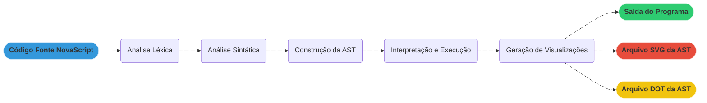

# NovaScript
> Este projeto é um trabalho colaborativo em dupla para uma atividade avaliativa na disciplina de **Compiladores** no curso de **Engenharia da Computação**, com o intuito de desenvolver uma linguagem de programação baseada no `JavaScript`, nomeada de `NovaScript`.

### Colaboradores:
- [Lorena Strobel Campos](https://github.com/lorena-strobel)
- [Mateus de Souza Arruda](https://github.com/mateus-sa)

### Docente:
- [Ed Wilson Tavares Ferreira](https://github.com/edwilsonferreira)


<br>

---

<br>


## 1. Funcionalidades da Linguagem NovaScript

O `NovaScript` suporta os seguintes comandos e construções:
- **Declaração de Variáveis:** `let variavel = valor` - declara uma ou mais variáveis com valores opcionais.
  - Ex: `let a = 10;`
  - Ex: `let x, y = 5, z;`

- **Entrada de Dados:** `prompt("mensagem")` - lê dados do usuário com conversão opcional de tipos.
  - Ex: `let idade = Number(prompt("Digite sua idade: "));`
  - Ex: `let valor = parseInt(prompt("Digite um número: "));`
  - Ex: `let decimal = parseFloat(prompt("Digite um decimal: "));`

- **Saída de Dados:** `console.log(expressão)` - exibe valores na saída padrão com suporte a concatenação.
  - Ex: `console.log("Olá Mundo!");`
  - Ex: `console.log("O resultado é: " + resultado);`

- **Expressões Aritméticas:** Suporte completo a `+`, `-`, `*`, `/` com precedência usual e uso de parênteses `()`.
  - Ex: `let resultado = (a + b) * (c / 2);`

- **Estruturas Condicionais:** `if/else` e `else if` com suporte a operadores lógicos.
  - Ex: `if (idade >= 18) { console.log("Maior de idade."); }`
  - Ex: `if (x > 0) { ... } else if (x < 0) { ... }`

- **Estruturas de Repetição:** `while`, `for` e `do-while`.
  - Ex: `while (i < 10) { i++; }`
  - Ex: `for (let i = 0; i < 5; i++) { console.log(i); }`
  - Ex: `do { console.log(i); i++; } while (i < 3);`

- **Operadores de Incremento/Decremento:** `++` e `--`.
  - Ex: `contador++;` ou `--valor;`

- **Operadores de Comparação:** `==`, `!=`, `>`, `<`, `>=`, `<=`.

- **Operadores Lógicos:** `&&` (AND), `||` (OR), `!` (NOT).

- **Tipos de Dados:** Suporte a números inteiros, decimais, strings e identificadores.

- **Ponto e Vírgula Opcional:** Comandos podem ser terminados opcionalmente com `;`.


<br>

---

<br>


## 2. Arquitetura do Interpretador

O interpretador segue as fases tradicionais do processamento de linguagens: transformando o código fonte em execução direta.

**Visão Geral**


**Fluxo do Processamento**

`NovaScript` utiliza o `ANTLR4` para gerar automaticamente o analisador **Léxico** e **Sintático** a partir da gramática definida em `NovaScript.g4`. Seguindo as etapas:
  1. **Análise Léxica:** Converte o código fonte em `tokens`.
  2. **Análise Sintática:** Valida a estrutura e gera a árvore de **Parse**.
  3. **Construção da AST:** Converte a árvore de **Parse** em uma AST simplificada.
  4. **Interpretação:** Executa o código atravessando a AST.
  5. **Visualização:** Gera representação gráfica da AST.


<br>

---

<br>


## 3. Estrutura do Projeto e Módulos

O trabalho é organizado em módulos `JavaScript`:

**Arquivo de Gramática e Parser Gerados**

1. `NovaScript.g4`
  - **Função:** arquivo de gramática formal da linguagem `NovaScript`, escrito na sintaxe do `ANTLR4`.
  - **Responsabilidade:** define as regras léxicas (`tokens`) e sintáticas (estruturas de comandos e expressões).

2. `NovaScriptLexer.js`, `NovaScriptParser.js`, `NovaScriptVisitor.js`, `NovaScriptListener.js`
  - **Função:** arquivos gerados automaticamente pelo ANTLR4 a partir da gramática.
  - **Responsabilidade:** implementam o analisador `léxico`, `sintático` e padrões `visitor/listener`.

<br>

**Módulos Principais**

3. `src/main.js`
  - **Função:** ponto de entrada principal do interpretador.
  - **Responsabilidade:** coordena todo o processo de interpretação, desde a leitura do arquivo até a geração de visualizações.

4. `src/AstBuilderVisitor.js`
  - **Função:** construtor da Árvore Sintática Abstrata (AST).
  - **Responsabilidade:** percorre a árvore de parse gerada pelo `ANTLR4` e constrói uma AST simplificada.

5. `src/NovaScriptErrorListener.js`
  - **Função:** tratamento personalizado de erros.
  - **Responsabilidade:** captura e formata erros léxicos e sintáticos de forma amigável.

6. `src/interpreter/InterpreterVisitor.js`
  - **Função:** interpretador principal que executa o código.
  - **Responsabilidade:** percorre a AST e executa as instruções, mantendo o estado das variáveis.

<br>

**Configuração e Dependências**

7. `package.json`
  - **Função:** configuração do projeto `Node.js`.
  - **Responsabilidade:** define dependências, scripts e metadados do projeto.

8. `requirements.txt`
  - **Função:** dependências `Python` para ferramentas auxiliares.
  - **Responsabilidade:** lista as dependências Python necessárias (`antlr4-tools`).


<br>

---

<br>


## 4. Configuração e Instalação

Procedimentos de configuração do ambiente para execução do interpretador `NovaScript`.

**Pré-requisitos:**
- **Node.js**
- **Python3**

<br>

**Instalação:**
  1. **Clone o repositório:**
```bash
git clone https://github.com/lorena-strobel/NovaScript.git
cd NovaScript
```

  2. **Instale as dependências Node.js:**
```bash
npm install
```

  3. **Configure o ambiente Python:**

  Unix/Linux/macOS:
```bash
python3 -m venv .venv
source .venv/bin/activate
pip install -r requirements.txt
```

  Windows:
```text
python -m venv .venv
.venv\Scripts\activate
pip install -r requirements.txt
```

<br>

**Geração dos Arquivos Parser:**

Sempre que o arquivo de gramática `NovaScript.g4` for modificado, regenere os arquivos do **Parser**:
```bash
npm run antlr4
```

Ou manualmente com `antlr4-tools`:
```bash
antlr4 -Dlanguage=JavaScript NovaScript.g4 -visitor
```


<br>

---

<br>


## 5. Como Executar o Interpretador

Após configurar o ambiente, execute o interpretador passando o caminho para seu arquivo `NovaScript`:

```bash
node src/main.js caminho/para/seu_arquivo.ns
```
<br>

**Exemplos:**
```bash
node src/main.js examples/teste.ns
node src/main.js examples/teste_completo.ns
node src/main.js examples/teste_io.ns
```
<br>

**Saída do Interpretador:**

O interpretador produz:
  1. **Execução do programa:** saída direta do seu código `NovaScript`
  2. **Arquivo DOT:** `output/nome_do_arquivo.ast.dot` - representação da AST para `Graphviz`
  3. **Imagem SVG:** `output/nome_do_arquivo.ast.svg` - visualização gráfica da AST
  4. **JSON da AST:** exibido no terminal para depuração

**Exemplos de Execução:**
```bash
$ node src/main.js examples/teste.ns

Lendo o arquivo: examples/teste.ns
Iniciando análise...
Análise concluída com sucesso.
Construindo a Árvore Sintática Abstrata (AST)...
AST construída com sucesso.
Arquivo .dot da AST salvo em: output/teste.ast.dot
Gerando imagem da AST...
Imagem SVG da AST salva em: output/teste.ast.svg

Iniciando execução do programa...
-----------------------------------
O resultado da soma é: 30
-----------------------------------
Execução concluída.
```


<br>

---

<br>


## 6. Visualização da AST

O `NovaScript` gera automaticamente visualizações da **Árvore Sintática Abstrata** para auxiliar na depuração.

**Arquivos Gerados**
  - `.ast.dot`: arquivo de descrição da AST no formato **DOT** (`Graphviz`)
  - `.ast.svg`: imagem vetorial da AST para visualização efetiva

<br>

**Testando com a Gramática**

Para testar rapidamente a gramática no terminal:

```bash
$ antlr4-parse NovaScript.g4 programa -tree
let num = 10;
^D
```
> (Use `Ctrl+D` no **Unix/Linux/macOS** ou `Ctrl+Z` no **Windows** para indicar fim da entrada)


<br>

---

<br>


## 7. Exemplos

O diretório `examples/` contém arquivos de código `NovaScript` para teste:

**Exemplo Básico (**`teste.ns`**)**
```novascript
let a = 10;
let b = 20;
let resultado = a + b;

console.log("O resultado da soma é: " + resultado);
```
<br>

**Exemplo com Estruturas de Controle (**`teste_completo.ns`**)**
```novascript
let i = 0;
let max = 5;

while (i < max) {
    if (i == 2) {
        console.log("Encontrei o 2");
    } else {
        console.log("Iteração: " + i);
    }
    i++;
}
```
<br>

**Exemplo com Entrada e Saída (**`teste_io.ns`**)**
```novascript
let nome = prompt("Digite seu nome: ");
let idade = Number(prompt("Digite sua idade: "));

console.log("Olá, " + nome + "!");
console.log("Você tem " + idade + " anos.");
```
<br>

**Exemplos de Erro**

O projeto também inclui exemplos para testar o tratamento de erros:

- `erro_lexico.ns`: Demonstra erros léxicos
- `erro_sintatico.ns`: Demonstra erros sintáticos
- `erro_custom.ns`: Demonstra erros de execução

<br>

**Executando os Exemplos**
```bash
# Exemplo básico
node src/main.js examples/teste.ns

# Exemplo com estruturas de controle
node src/main.js examples/teste_completo.ns

# Exemplo com entrada/saída (interativo)
node src/main.js examples/teste_io.ns

# Testando tratamento de erros
node src/main.js examples/erro_sintatico.ns
```